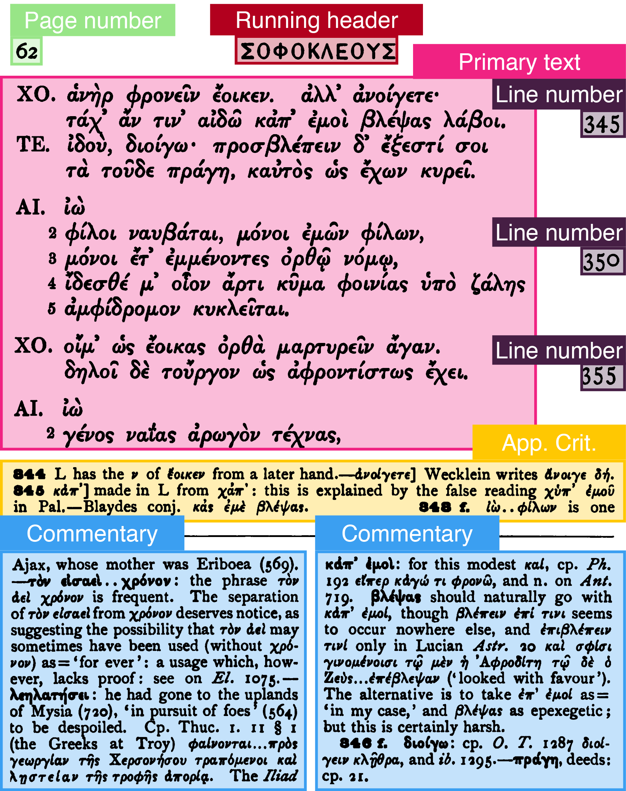

# Layout Ground Truth for Historical Commentaries

[](https://creativecommons.org/licenses/by/4.0/)     

## Description

GT4HistCommentLayout contains layout annotations for ca. 370 pages sampled from 8 public domain classical commentaries, published in the 19th century in English, German and Latin. The commentaries concern Ancient Greek and Latin works from prose and poetry (caveat: AGreek poetry is slightly over-represented). 

⚠️ **NB**: this dataset contains exclusively *layout* annotations. A [separate dataset with OCR groundtruth data](https://github.com/AjaxMultiCommentary/GT-commentaries-OCR) exists for classical commentaries, but sources and annotated pages differ between the two.

An example of annotated commentary page is shown in the image below. Pages were annotated according to a taxonomy mapped to the [SegmOnto](https://segmonto.github.io/) controlled vocabulary.



## Sources

| ID                        | Genre  | Lang.  | Bibl. Ref.                                                                                       |
|---------------------------|--------|--------|--------------------------------------------------------------------------------------------------|
| [annalsoftacitusp00taci](https://archive.org/details/annalsoftacitusp00taci)    | prose  | Latin  | H. Furneaux. 1896. *The annals of Tacitus. P. Cornelii Taciti annalium ab excessu Divi Augusti libri*. Oxford|
| [bsb10234118](https://archive.org/details/bsb10234118)               | poetry | Agreek |Lobeck, Christian August. 1835. *Sophoclis Aiax*. Leipzig: Weidmann                               |
| [cu31924087948174](https://archive.org/details/cu31924087948174)          | poetry | AGreek |Lewis Campbell. 1881. *Sophocles*. Oxford : Clarendon Press                                       | 
| [pvergiliusmaroa00virggoog](https://archive.org/details/pvergiliusmaroa00virggoog) | poetry | Latin  |Norden, E. *Aen. 6*. 1903. Leipzig: Teubner                                                               | 
| [sophoclesplaysa05campgoog](https://archive.org/details/sophoclesplaysa05campgoog) | poetry | AGreek |Jebb, Richard Claverhouse. 1896. *Sophocles: The Plays and Fragments*. London: Cambridge University Press.|
| [sophokle1v3soph](https://archive.org/details/sophokle1v3soph)           | poetry | Agreek |Schneidewin, Friedrich Wilhelm. 1853. *Sophokles Erklaert von F. W. Schneidewin*. Leipzig: Weidmann |
| [thukydides02thuc](https://archive.org/details/thukydides02thuc)          | prose  | AGreek |J. Classen & J. Steup. 1889. *Thukydides erklärt, 7.*, Weidmann: Berlin | 
| [Wecklein1894](https://archive.org/details/Wecklein1894)              | poetry | AGreek |Wecklein, Nikolaus. 1894. *Sophokleus Aias*. München: Lindauer|

## Statistics

Detailed statistics about the annotated dataset can be found in the [`stats.txt`](./stats.txt) (automatically generated by `humGenerator`).

## Citation

If you use this dataset in your research, please cite the following publication:

```
@inproceedings{najem-meyer_page-layout-analysis_2022,
  title = {Page {{Layout Analysis}} of {{Text-heavy Historical Documents}}: A {{Comparison}} of {{Textual}} and {{Visual Approaches}}},
  booktitle = {Proceedings of the {{Conference}} on {{Computational Humanities Research}} 2022},
  author = {{Najem-Meyer}, Sven and Romanello, Matteo},
  year = {2022},
  publisher = {{CEUR-WS}},
  address = {{Antwerp}}
}
```

## License

This dataset is released under a Creative Commons Attribution license ([CC BY](./LICENSE)).

## Acknowledgements

Data in this repository were produced in the context of the Ajax Multi-Commentary project, funded by the Swiss National Science Foundation under an Ambizione grant [PZ00P1\_186033](http://p3.snf.ch/project-186033).

Contributors: Carla Amaya (UNIL), Sven Najem-Meyer (EPFL), Matteo Romanello (UNIL).