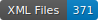

# OLR Ground Truth for Historical Commentaries

     

## Data

This dataset contains layout annotations for ca. 370 pages sampled from 8 public domain classical commentaries, published in the 19th century in English, German and Latin. The commentaries concern Ancient Greek and Latin works from prose and poetry (caveat: AGreek poetry is slightly over-represented). 

An example of annotated commentary page is shown in the image below. Pages were annotated according to a taxonomy mapped to the [SegmOnto](https://segmonto.github.io/) controlled vocabulary.

## Statistics

Detailed statistics about the annotated dataset can be found in the [`stats.txt`](./stats.txt) (automatically generated by `humGenerator`).

## Citation

If you use this dataset in your research, please cite the following publication:

(TODO: coming soon)

## Acknowledgements

Data in this repository were produced in the context of the Ajax Multi-Commentary project, funded by the Swiss National Science Foundation under an Ambizione grant [PZ00P1\_186033](http://p3.snf.ch/project-186033).

Contributors: Carla Amaya (UNIL), Sven Najem-Meyer (EPFL), Matteo Romanello (UNIL).